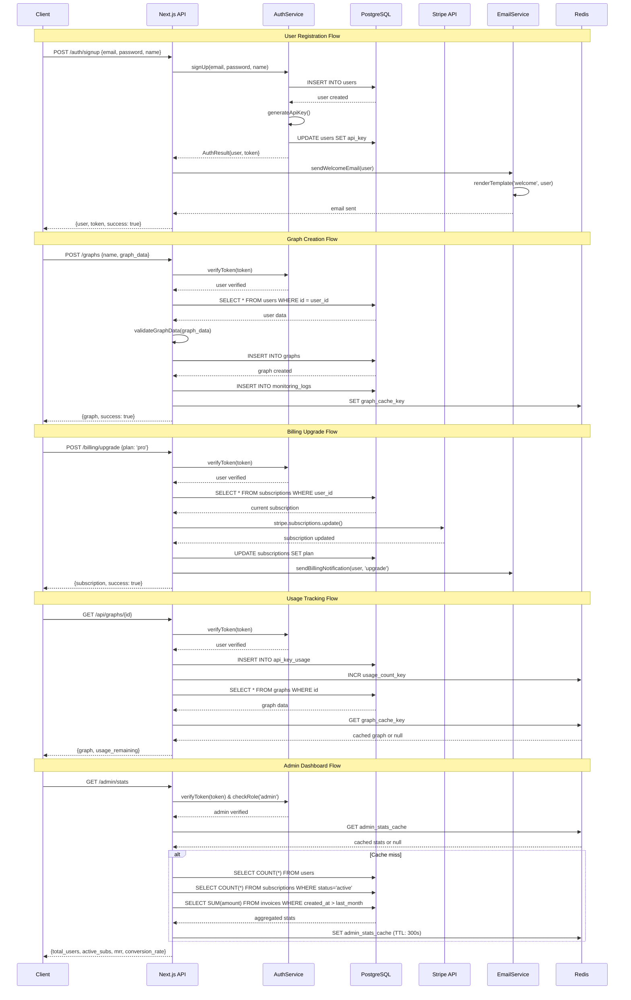

# SandVar Orrery SaaS Platform - System Design

## Implementation Approach

We will build a modern, scalable SaaS platform using a Next.js full-stack architecture with TypeScript. The key challenging aspects include:

1. **3D Visualization Performance**: React Three Fiber integration requires optimized rendering for complex workflows with 1000+ nodes
2. **Real-time Data Synchronization**: Implementing efficient state management for collaborative workflow editing
3. **Complex Nested Agent System**: Hierarchical data structures for custom agents with proper serialization/deserialization
4. **Enterprise-Grade Billing**: Stripe integration with webhook reliability and usage tracking
5. **Scalable Authentication**: Supporting both email/password and Google OAuth with role-based access control

**Technology Stack Selection:**
- **Frontend**: Next.js 14 + TypeScript + Tailwind CSS + React Three Fiber for optimal performance and SEO
- **Backend**: Next.js API routes with tRPC for type-safe API communication
- **Database**: PostgreSQL with Prisma ORM for complex relational data and migrations
- **Authentication**: NextAuth.js for unified auth flow with JWT sessions
- **Payments**: Stripe SDK with webhook handling for subscription management
- **Email**: Resend for transactional emails with React Email templates
- **Deployment**: Vercel for frontend + Supabase for database + Redis for caching

## Data Structures and Interfaces

```mermaid
classDiagram
    class User {
        +id: UUID
        +name: string
        +email: string
        +password?: string
        +provider: AuthProvider
        +plan: PlanType
        +api_key?: string
        +role: UserRole
        +theme: ThemeType
        +created_at: DateTime
        +updated_at: DateTime
        +trial_ends_at?: DateTime
        +__init__(email: string, name: string)
        +generateApiKey(): string
        +updatePlan(plan: PlanType): Promise<void>
        +isTrialExpired(): boolean
        +canAccessFeature(feature: string): boolean
    }

    class Graph {
        +id: UUID
        +user_id: UUID
        +name: string
        +description?: string
        +graph_data: JSON
        +is_custom_agent: boolean
        +is_public: boolean
        +created_at: DateTime
        +updated_at: DateTime
        +__init__(user_id: UUID, name: string)
        +serialize(): JSON
        +deserialize(data: JSON): void
        +validateStructure(): boolean
        +clone(): Graph
    }

    class Subscription {
        +id: UUID
        +user_id: UUID
        +stripe_customer_id: string
        +stripe_subscription_id: string
        +plan: PlanType
        +status: SubscriptionStatus
        +current_period_start: DateTime
        +current_period_end: DateTime
        +created_at: DateTime
        +updated_at: DateTime
        +__init__(user_id: UUID, plan: PlanType)
        +isActive(): boolean
        +cancelAtPeriodEnd(): Promise<void>
        +upgrade(new_plan: PlanType): Promise<void>
    }

    class MonitoringLog {
        +id: UUID
        +user_id: UUID
        +graph_id?: UUID
        +event_type: string
        +data: JSON
        +timestamp: DateTime
        +__init__(user_id: UUID, event_type: string)
        +track(event: string, data: JSON): Promise<void>
    }

    class ApiKeyUsage {
        +id: UUID
        +user_id: UUID
        +api_key: string
        +endpoint: string
        +method: string
        +status_code: number
        +response_time: number
        +timestamp: DateTime
        +__init__(user_id: UUID, api_key: string)
        +recordUsage(endpoint: string, method: string): Promise<void>
        +getUsageStats(period: string): Promise<UsageStats>
    }

    class AuthService {
        +signUp(email: string, password: string): Promise<AuthResult>
        +signIn(email: string, password: string): Promise<AuthResult>
        +signInWithGoogle(token: string): Promise<AuthResult>
        +signOut(): Promise<void>
        +verifyToken(token: string): Promise<User>
        +refreshToken(refreshToken: string): Promise<AuthResult>
    }

    class GraphService {
        +createGraph(data: CreateGraphInput): Promise<Graph>
        +updateGraph(id: UUID, data: UpdateGraphInput): Promise<Graph>
        +deleteGraph(id: UUID): Promise<void>
        +getGraph(id: UUID): Promise<Graph>
        +getUserGraphs(user_id: UUID): Promise<Graph[]>
        +createCustomAgent(graph_id: UUID): Promise<Graph>
        +validateGraphData(data: JSON): Promise<ValidationResult>
    }

    class BillingService {
        +createCustomer(user: User): Promise<StripeCustomer>
        +createSubscription(customer_id: string, plan: PlanType): Promise<Subscription>
        +handleWebhook(event: StripeEvent): Promise<void>
        +upgradeSubscription(subscription_id: string, plan: PlanType): Promise<void>
        +cancelSubscription(subscription_id: string): Promise<void>
        +generateInvoice(subscription_id: string): Promise<Invoice>
    }

    class EmailService {
        +sendWelcomeEmail(user: User): Promise<void>
        +sendTrialExpiryEmail(user: User): Promise<void>
        +sendBillingNotification(user: User, type: string): Promise<void>
        +sendPasswordReset(email: string, token: string): Promise<void>
        +renderTemplate(template: string, data: any): Promise<string>
    }

    class AdminService {
        +getUserStats(): Promise<AdminStats>
        +getUserList(filters: UserFilters): Promise<PaginatedUsers>
        +updateUserPlan(user_id: UUID, plan: PlanType): Promise<void>
        +createAdminUser(data: CreateAdminInput): Promise<User>
        +getSystemHealth(): Promise<HealthStatus>
        +exportUserData(user_id: UUID): Promise<ExportData>
    }

    User ||--o{ Graph : owns
    User ||--|| Subscription : has
    User ||--o{ MonitoringLog : generates
    User ||--o{ ApiKeyUsage : tracks
    AuthService ..> User : manages
    GraphService ..> Graph : manages
    BillingService ..> Subscription : manages
    EmailService ..> User : notifies
    AdminService ..> User : administers
```

## Program Call Flow



## Database Schema Design

### Users Table
```sql
CREATE TABLE users (
    id UUID PRIMARY KEY DEFAULT gen_random_uuid(),
    name VARCHAR(255) NOT NULL,
    email VARCHAR(255) UNIQUE NOT NULL,
    password VARCHAR(255), -- nullable for OAuth users
    provider VARCHAR(50) NOT NULL DEFAULT 'email', -- 'email' | 'google'
    plan VARCHAR(20) NOT NULL DEFAULT 'free', -- 'free' | 'pro' | 'enterprise'
    api_key VARCHAR(255) UNIQUE,
    role VARCHAR(20) NOT NULL DEFAULT 'user', -- 'user' | 'admin'
    theme VARCHAR(20) NOT NULL DEFAULT 'system', -- 'light' | 'dark' | 'system'
    trial_ends_at TIMESTAMP,
    created_at TIMESTAMP DEFAULT NOW(),
    updated_at TIMESTAMP DEFAULT NOW(),
    
    INDEX idx_email (email),
    INDEX idx_api_key (api_key),
    INDEX idx_plan (plan),
    INDEX idx_created_at (created_at)
);
```

### Graphs Table
```sql
CREATE TABLE graphs (
    id UUID PRIMARY KEY DEFAULT gen_random_uuid(),
    user_id UUID NOT NULL REFERENCES users(id) ON DELETE CASCADE,
    name VARCHAR(255) NOT NULL,
    description TEXT,
    graph_data JSONB NOT NULL, -- stores node and edge data
    is_custom_agent BOOLEAN DEFAULT FALSE,
    is_public BOOLEAN DEFAULT FALSE,
    created_at TIMESTAMP DEFAULT NOW(),
    updated_at TIMESTAMP DEFAULT NOW(),
    
    INDEX idx_user_id (user_id),
    INDEX idx_is_custom_agent (is_custom_agent),
    INDEX idx_created_at (created_at),
    INDEX gin_graph_data (graph_data) -- GIN index for JSONB queries
);
```

### Subscriptions Table
```sql
CREATE TABLE subscriptions (
    id UUID PRIMARY KEY DEFAULT gen_random_uuid(),
    user_id UUID NOT NULL REFERENCES users(id) ON DELETE CASCADE,
    stripe_customer_id VARCHAR(255) NOT NULL,
    stripe_subscription_id VARCHAR(255) UNIQUE NOT NULL,
    plan VARCHAR(20) NOT NULL, -- 'free' | 'pro' | 'enterprise'
    status VARCHAR(50) NOT NULL, -- 'active' | 'canceled' | 'past_due' | 'trialing'
    current_period_start TIMESTAMP NOT NULL,
    current_period_end TIMESTAMP NOT NULL,
    created_at TIMESTAMP DEFAULT NOW(),
    updated_at TIMESTAMP DEFAULT NOW(),
    
    UNIQUE(user_id), -- One subscription per user
    INDEX idx_stripe_customer_id (stripe_customer_id),
    INDEX idx_stripe_subscription_id (stripe_subscription_id),
    INDEX idx_status (status)
);
```

### Monitoring Logs Table
```sql
CREATE TABLE monitoring_logs (
    id UUID PRIMARY KEY DEFAULT gen_random_uuid(),
    user_id UUID NOT NULL REFERENCES users(id) ON DELETE CASCADE,
    graph_id UUID REFERENCES graphs(id) ON DELETE SET NULL,
    event_type VARCHAR(100) NOT NULL, -- 'graph_created', 'workflow_executed', etc.
    data JSONB, -- flexible event data
    timestamp TIMESTAMP DEFAULT NOW(),
    
    INDEX idx_user_id (user_id),
    INDEX idx_graph_id (graph_id),
    INDEX idx_event_type (event_type),
    INDEX idx_timestamp (timestamp),
    INDEX gin_data (data) -- GIN index for JSONB queries
);
```

### API Key Usage Table
```sql
CREATE TABLE api_key_usage (
    id UUID PRIMARY KEY DEFAULT gen_random_uuid(),
    user_id UUID NOT NULL REFERENCES users(id) ON DELETE CASCADE,
    api_key VARCHAR(255) NOT NULL,
    endpoint VARCHAR(255) NOT NULL,
    method VARCHAR(10) NOT NULL, -- GET, POST, PUT, DELETE
    status_code INTEGER NOT NULL,
    response_time INTEGER, -- in milliseconds
    timestamp TIMESTAMP DEFAULT NOW(),
    
    INDEX idx_user_id (user_id),
    INDEX idx_api_key (api_key),
    INDEX idx_endpoint (endpoint),
    INDEX idx_timestamp (timestamp),
    INDEX idx_status_code (status_code)
);
```

### Email Templates Table
```sql
CREATE TABLE email_templates (
    id UUID PRIMARY KEY DEFAULT gen_random_uuid(),
    name VARCHAR(255) UNIQUE NOT NULL, -- 'welcome', 'trial_expiry', etc.
    subject VARCHAR(255) NOT NULL,
    html_content TEXT NOT NULL,
    text_content TEXT NOT NULL,
    variables JSONB, -- template variables schema
    is_active BOOLEAN DEFAULT TRUE,
    created_at TIMESTAMP DEFAULT NOW(),
    updated_at TIMESTAMP DEFAULT NOW(),
    
    INDEX idx_name (name),
    INDEX idx_is_active (is_active)
);
```

## API Endpoints Specification

### Authentication Endpoints
```typescript
// POST /api/auth/signup
interface SignupRequest {
  email: string;
  password: string;
  name: string;
}
interface SignupResponse {
  user: User;
  token: string;
  success: boolean;
}

// POST /api/auth/signin
interface SigninRequest {
  email: string;
  password: string;
}
interface SigninResponse {
  user: User;
  token: string;
  success: boolean;
}

// POST /api/auth/google
interface GoogleAuthRequest {
  token: string;
}
interface GoogleAuthResponse {
  user: User;
  token: string;
  success: boolean;
}
```

### Graph Management Endpoints
```typescript
// GET /api/graphs
interface GetGraphsResponse {
  graphs: Graph[];
  total: number;
  page: number;
}

// POST /api/graphs
interface CreateGraphRequest {
  name: string;
  description?: string;
  graph_data: GraphData;
  is_custom_agent?: boolean;
}
interface CreateGraphResponse {
  graph: Graph;
  success: boolean;
}

// PUT /api/graphs/[id]
interface UpdateGraphRequest {
  name?: string;
  description?: string;
  graph_data?: GraphData;
}
interface UpdateGraphResponse {
  graph: Graph;
  success: boolean;
}

// DELETE /api/graphs/[id]
interface DeleteGraphResponse {
  success: boolean;
}
```

### Billing Endpoints
```typescript
// POST /api/billing/create-checkout
interface CreateCheckoutRequest {
  plan: 'pro' | 'enterprise';
  return_url: string;
}
interface CreateCheckoutResponse {
  checkout_url: string;
  success: boolean;
}

// POST /api/billing/portal
interface BillingPortalResponse {
  portal_url: string;
  success: boolean;
}

// POST /api/billing/webhook
interface WebhookRequest {
  stripe_event: StripeEvent;
}
interface WebhookResponse {
  success: boolean;
}
```

### Usage Analytics Endpoints
```typescript
// GET /api/usage
interface GetUsageResponse {
  current_period: {
    api_calls: number;
    graphs_created: number;
    monitoring_time: number;
  };
  limits: {
    api_calls: number;
    graphs_created: number;
    monitoring_time: number;
  };
  trial_days_remaining?: number;
}

// GET /api/usage/history
interface GetUsageHistoryQuery {
  start_date: string;
  end_date: string;
  granularity: 'day' | 'week' | 'month';
}
interface GetUsageHistoryResponse {
  data: Array<{
    date: string;
    api_calls: number;
    graphs_created: number;
  }>;
}
```

### Admin Endpoints
```typescript
// GET /api/admin/stats
interface AdminStatsResponse {
  users: {
    total: number;
    active_last_30_days: number;
    pro_users: number;
    trial_users: number;
  };
  revenue: {
    mrr: number;
    arr: number;
    growth_rate: number;
  };
  usage: {
    total_graphs: number;
    total_api_calls: number;
    avg_session_duration: number;
  };
}

// GET /api/admin/users
interface GetUsersQuery {
  page: number;
  limit: number;
  plan?: string;
  search?: string;
}
interface GetUsersResponse {
  users: User[];
  total: number;
  page: number;
  total_pages: number;
}

// PUT /api/admin/users/[id]
interface UpdateUserRequest {
  plan?: string;
  role?: string;
  trial_ends_at?: string;
}
interface UpdateUserResponse {
  user: User;
  success: boolean;
}
```

## Security Architecture

### Authentication & Authorization
- **JWT Tokens**: Short-lived access tokens (15 minutes) with refresh tokens (7 days)
- **Role-Based Access Control**: User and admin roles with granular permissions
- **API Key Management**: Secure generation and rotation of API keys for Pro users
- **Rate Limiting**: Implement rate limiting per user/IP with Redis-based counters
- **Input Validation**: Comprehensive validation using Zod schemas for all endpoints

### Data Protection
- **Encryption at Rest**: Database-level encryption for sensitive fields
- **Encryption in Transit**: HTTPS/TLS 1.3 for all communications
- **Password Hashing**: bcrypt with salt rounds of 12
- **CSRF Protection**: CSRF tokens for state-changing operations
- **CORS Configuration**: Strict CORS policies for API endpoints

### Infrastructure Security
- **Environment Variables**: Secure storage of secrets using Vercel environment variables
- **Database Security**: PostgreSQL with SSL connections and restricted access
- **Webhook Security**: Stripe webhook signature verification
- **Content Security Policy**: Strict CSP headers to prevent XSS attacks

## Deployment Strategy

### Production Architecture
```
Internet → Cloudflare CDN → Vercel Edge Network → Next.js Application
                                                ↓
                                         Supabase PostgreSQL
                                                ↓
                                         Redis Cache (Upstash)
                                                ↓
                                         External APIs (Stripe, Resend)
```

### Environment Configuration
- **Development**: Local Next.js + Local PostgreSQL + Local Redis
- **Staging**: Vercel Preview + Supabase Staging + Upstash Staging
- **Production**: Vercel Production + Supabase Production + Upstash Production

### Monitoring & Observability
- **Error Tracking**: Sentry for error monitoring and performance tracking
- **Analytics**: Vercel Analytics for performance metrics
- **Uptime Monitoring**: UptimeRobot for service availability
- **Database Monitoring**: Supabase built-in monitoring and alerts

## Scalability Considerations

### Database Optimization
- **Connection Pooling**: PgBouncer for efficient connection management
- **Read Replicas**: Implement read replicas for analytics queries
- **Indexing Strategy**: Optimize indexes for common query patterns
- **Data Archiving**: Archive old logs and usage data to maintain performance

### Caching Strategy
- **API Response Caching**: Redis caching for frequently accessed data
- **Static Asset Caching**: Vercel Edge Network for static assets
- **Database Query Caching**: Prisma query result caching
- **Session Caching**: Redis-based session storage for scalability

### Performance Optimization
- **Code Splitting**: Dynamic imports for large 3D components
- **Image Optimization**: Next.js Image component with Vercel optimization
- **Bundle Analysis**: Regular bundle size monitoring and optimization
- **3D Rendering**: WebGL optimization with React Three Fiber performance monitoring

## Maintainability Features

### Code Quality
- **TypeScript**: Full type safety across frontend and backend
- **ESLint + Prettier**: Consistent code formatting and linting
- **Testing Strategy**: Jest for unit tests, Playwright for E2E tests
- **Code Reviews**: Required PR reviews with automated checks

### Development Workflow
- **Git Flow**: Feature branches with automated deployment previews
- **CI/CD Pipeline**: GitHub Actions for testing and deployment
- **Database Migrations**: Prisma migrations with rollback capabilities
- **Environment Parity**: Consistent environments across dev/staging/prod

### Documentation
- **API Documentation**: OpenAPI/Swagger documentation for all endpoints
- **Component Library**: Storybook for UI component documentation
- **Architecture Docs**: Detailed system architecture and decision records
- **Deployment Guides**: Step-by-step deployment and maintenance procedures

## Anything UNCLEAR

The following aspects need clarification or further consideration:

1. **Workflow Execution Engine**: The PRD mentions workflow execution but doesn't specify if this should be real-time execution or scheduled execution. This impacts the architecture significantly.

2. **Real-time Collaboration**: While mentioned in Phase 3, the technical approach (WebSockets, WebRTC, or operational transforms) needs to be specified earlier for proper architecture planning.

3. **3D Performance Requirements**: The exact performance requirements for the 3D interface (target FPS, maximum number of simultaneous nodes, mobile performance) need clarification.

4. **Data Retention Policy**: How long should we retain user data, logs, and usage analytics? This impacts storage costs and compliance requirements.

5. **Enterprise Deployment**: Should we support on-premise deployment for enterprise customers? This would require containerization and different architecture considerations.

6. **Integration Priorities**: Which third-party integrations should be prioritized in MVP vs later phases? This affects API design and data models.

7. **Mobile Experience**: The PRD mentions mobile responsiveness but doesn't specify the level of functionality expected on mobile devices for the 3D workflow editor.

8. **Backup and Disaster Recovery**: What are the RTO/RPO requirements? This impacts database backup strategies and geographic distribution.